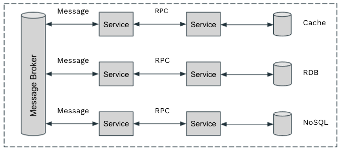

# meta-protocol-proxy

## 为什么需要 MetaProtocol ?

目前几乎所有的开源和商业 Service Mesh 都只支持了 HTTP 和 gRPC 两种七层协议。微服务中的其他常见协议，包括 Dubbo、Thrift、Redis、MySql 等，
在 Service Mesh 中只能被作为 TCP 流量进行处理，无法进行高级的流量管理。此外，如果微服务采用了自定义的 RPC 协议进行通信，也无法纳入 
Service Mesh 中进行管理。

如下图所示，一个微服务应用中通常会有这些七层流量：
* RPC： HTTP、gRPC、Dubbo、Thrift、私有 RPC 协议 ...
* Async Message：Kafka, RabbitMQ ...
* DB：mySQL, PostgreSQL, MongoDB ...


## MetaProtocol 解决方案

MetaProtocol 实现为一个能够在 Service Mesh 中管理任何七层协议的通用协议框架。MetaProtocol 在 Service Mesh 中为微服务中的各种七层协议流量提供以下标准能力：
* 数据面：MetaProtocol Proxy 提供服务发现、负载均衡、熔断、路由、权限控制、限流、故障注入等公共的基础能力。
  
* 控制面：[Aeraki](https://github.com/aeraki-framework/aeraki) 提供控制面管理，为数据面下发 MetaProtocol Proxy 配置和 RDS 配置，实现流量拆分、灰度/蓝绿发布、地域感知负载均衡、
  流量镜像、基于角色的权限控制等高级路由和服务治理能力。
  

要将一个七层协议纳入 Service Mesh 中进行管控，只需基于 MetaProtocol Proxy 数据面进行少量二次开发，实现
[协议编解码的接口](src/meta_protocol_proxy/codec/codec.h#L118)即可。

除了 MetaProtocol Proxy 自带的通用能力之外，还提供基于 C++、Lua、WASM 的 L7 filter 插件机制，允许用户在 MetaProtocol 基础上创建自定义七层 filter，加入特殊定制逻辑。

## 构建 MetaProtocol Proxy

参考 [Building Envoy with Bazel](https://github.com/envoyproxy/envoy/blob/main/bazel/README.md) 安装构建所需的软件。

运行 ```./build.sh```，如果构建顺利完成，生成的二进制文件路径为 bazel-bin/envoy ，该二进制文件中包含了 MetaProtocol Proxy 和
基于 MetaProtocol Proxy 实现的 Dubbo 协议。

## 测试 MetaProtocol Proxy

运行 ```./test/test.sh ```，该命令会启动 envoy 和 dubbo 测试程序。如果执行顺利，你可以看到下面的输出：

```bash
Hello Aeraki, response from ed9006021490/172.17.0.2
Hello Aeraki, response from ed9006021490/172.17.0.2
Hello Aeraki, response from ed9006021490/172.17.0.2
```

该输出表示 dubbo 客户端通过 envoy 成功调用到 dubbo 服务器端。你可以查看 [test\test.yaml](test/test.yaml) 文件，以了解 MetaProtocol 的具体配置。
