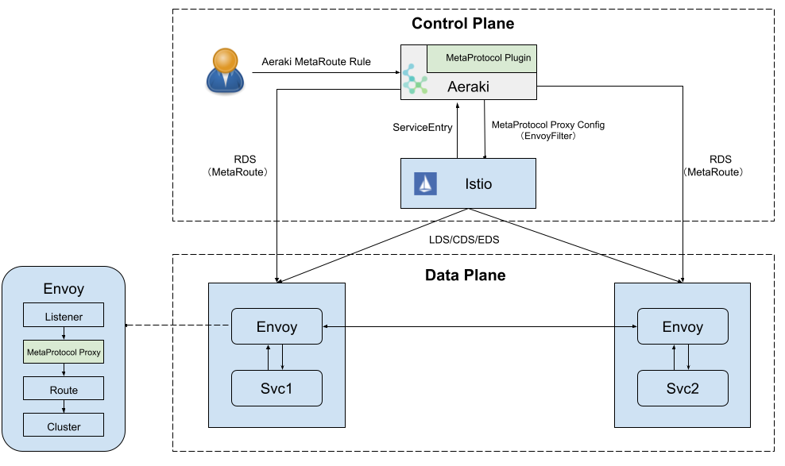

# meta-protocol-proxy

## 为什么需要 MetaProtocol ?

目前几乎所有的开源和商业 Service Mesh 都只支持了 HTTP 和 gRPC 两种七层协议。微服务中的其他常见协议，包括 Dubbo、Thrift、Redis、MySql 等，
在 Service Mesh 中只能被作为 TCP 流量进行处理，无法进行高级的流量管理。此外，如果微服务采用了自定义的 RPC 协议进行通信，也无法纳入 
Service Mesh 中进行管理。

如下图所示，一个微服务应用中通常会有这些七层流量：
* RPC： HTTP、gRPC、Dubbo、Thrift、私有 RPC 协议 ...
* Async Message：Kafka, RabbitMQ ...
* DB：mySQL, PostgreSQL, MongoDB ...


## MetaProtocol 解决方案

MetaProtocol 实现为一个能够在 Service Mesh 中管理任何七层协议的通用协议框架。MetaProtocol 在 Service Mesh 中为微服务中的各种七层协议流量提供以下标准能力：
* 数据面：MetaProtocol Proxy 提供服务发现、负载均衡、熔断、路由、权限控制、限流、故障注入等公共的基础能力。
  
* 控制面：[Aeraki](https://github.com/aeraki-framework/aeraki) 提供控制面管理，为数据面下发 MetaProtocol Proxy 配置和 RDS 配置，实现流量拆分、灰度/蓝绿发布、地域感知负载均衡、
  流量镜像、基于角色的权限控制等高级路由和服务治理能力。
  

要将一个七层协议纳入 Service Mesh 中进行管控，只需基于 MetaProtocol Proxy 数据面进行少量二次开发，实现
[协议编解码的接口](src/meta_protocol_proxy/codec/codec.h#L118)即可。

除了 MetaProtocol Proxy 自带的通用能力之外，还提供基于 C++、Lua、WASM 的 L7 filter 插件机制，允许用户在 MetaProtocol 基础上创建自定义七层 filter，加入特殊定制逻辑。

## 构建 MetaProtocol Proxy

参考 [Building Envoy with Bazel](https://github.com/envoyproxy/envoy/blob/main/bazel/README.md) 安装构建所需的软件。

推荐使用 Ubuntu 18.04，Ubuntu 上的构建流程如下：

### 安装 Bazelisk

建议使用 Bazelisk，以规避 Bazel 的兼容性问题。

```bash
sudo wget -O /usr/local/bin/bazel https://github.com/bazelbuild/bazelisk/releases/latest/download/bazelisk-linux-$([ $(uname -m) = "aarch64" ] && echo "arm64" || echo "amd64")
sudo chmod +x /usr/local/bin/bazel
```

### 安装外部依赖

```bash
sudo apt-get install autoconf automake cmake curl libtool make ninja-build patch python3-pip unzip virtualenv libc++-10-dev
```

### 安装 LLVM
x86
```bash
cd /home/ubuntu \
  && wget https://github.com/llvm/llvm-project/releases/download/llvmorg-10.0.0/clang+llvm-10.0.0-x86_64-linux-gnu-ubuntu-18.04.tar.xz \
  && tar -xvf clang+llvm-10.0.0-x86_64-linux-gnu-ubuntu-18.04.tar.xz -C clang+llvm-10.0.0-linux-gnu --strip-components 1 \
  && rm clang+llvm-10.0.0-x86_64-linux-gnu-ubuntu-18.04.tar.xz
```

arm
```bash
cd /home/ubuntu \
  && wget https://github.com/llvm/llvm-project/releases/download/llvmorg-10.0.0/clang+llvm-10.0.0-aarch64-linux-gnu.tar.xz \
  && tar -xvf clang+llvm-10.0.0-aarch64-linux-gnu.tar.xz -C clang+llvm-10.0.0-linux-gnu --strip-components 1 \
  && rm clang+llvm-10.0.0-aarch64-linux-gnu.tar.xz
```

### 设置 clang

```bash
./bazel/setup_clang.sh /home/ubuntu/clang+llvm-10.0.0-linux-gnu
```

### 编译
运行 ```make build```，如果构建顺利完成，生成的二进制文件路径为 bazel-bin/envoy ，该二进制文件中包含了 MetaProtocol Proxy 和
基于 MetaProtocol Proxy 实现的 Dubbo 协议。
生产环境使用，运行 ```make release```

## 使用 Docker 构建 MetaProtocol Proxy
现在支持 x86 和 arm 架构
### 设置 meta-protocol-proxy 代码库 path

```bash
export META_PROTOCOL_PROXY_REPO=/path/to/meta-protocol-proxy
```

### 启动构建容器

```bash
docker run -it --name meta-protocol-proxy-build -v ${META_PROTOCOL_PROXY_REPO}:/meta-protocol-proxy aeraki/meta-protocol-proxy-build:2022-0429-0 bash
```

### 编译
```bash
cd /meta-protocol-proxy
make build
```

## 测试 MetaProtocol Proxy

目前已经基于 MetaProtocol 实现了 [Dubbo](src/application_protocols/dubbo) 和 [Thrift](src/application_protocols/thrift
) 两种七层协议。更多协议正在开发中。

### Dubbo
因为测试客户端会采用域名 ```org.apache.dubbo.samples.basic.api.demoservice``` 来访问服务器，因此需要在
主机的 hosts 文件中加入下面一行记录：

```bash
127.0.0.1 org.apache.dubbo.samples.basic.api.demoservice
```

然后运行 ```./test/dubbo/test.sh ```，该命令会启动 envoy 和 dubbo 测试程序。如果执行顺利，你可以看到类似下面的输出：

```bash
Hello Aeraki, response from ed9006021490/172.17.0.2
Hello Aeraki, response from ed9006021490/172.17.0.2
Hello Aeraki, response from ed9006021490/172.17.0.2
```

该输出表示 dubbo 客户端通过 envoy 成功调用到 dubbo 服务器端。你可以查看 [test/dubbo/test.yaml](test/dubbo/test.yaml) 文件，以了解 MetaProtocol 的具体配置。

### Thrift

运行 ```./test/thrift/test.sh ```，该命令会启动 envoy 和 thrift 测试程序。如果执行顺利，你可以看到类似下面的输出：

```bash
Hello Aeraki, response from ae6582f53868/172.17.0.2
Hello Aeraki, response from ae6582f53868/172.17.0.2
Hello Aeraki, response from ae6582f53868/172.17.0.2
```

该输出表示 thrift 客户端通过 envoy 成功调用到 thrift 服务器端。你可以查看 [test/thrift/test.yaml](test/thrift/test.yaml) 文件，以了解 MetaProtocol 的具体配置。

### RDS

MetaProtocol 框架代码实现了 RDS 协议。MetaProtocol Proxy 会和配置的 RDS 服务器进行实时通信，获取路由配置。当路由配置更新后，MetaProtocol Proxy 会将更新的路由配置应用到后续的请求中，路由更新不会导致已有连接发生中断。

参照 Dubbo 测试步骤设置 dns 域名，然后运行 ```./test/rds/test.sh ```，该命令会启动 envoy，RDS 服务器 和 dubbo 测试程序。如果执行顺利，你可以看到类似下面的输出：

```bash
Hello Aeraki, response from 400c8a27e761/172.17.0.2
Hello Aeraki, response from 400c8a27e761/172.17.0.2
Hello Aeraki, response from 400c8a27e761/172.17.0.2
```

该输出表示 dubbo 客户端通过 envoy 成功调用到 dubbo 服务器端，并且 envoy 的路由配置来自于 RDS 服务器。你可以查看 [test/rds/test.yaml](test/rds/test.yaml) 文件，以了解 MetaProtocol RDS 的相关配置。
